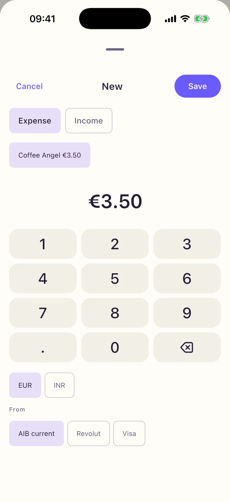
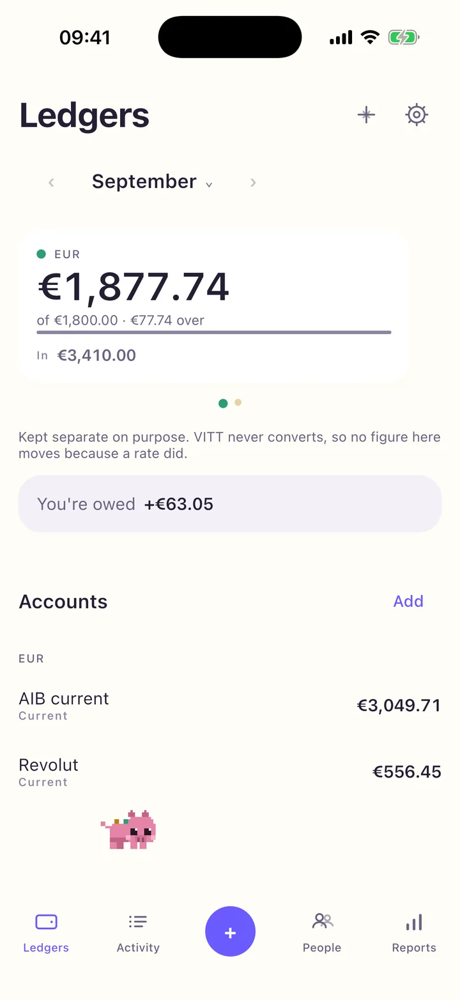
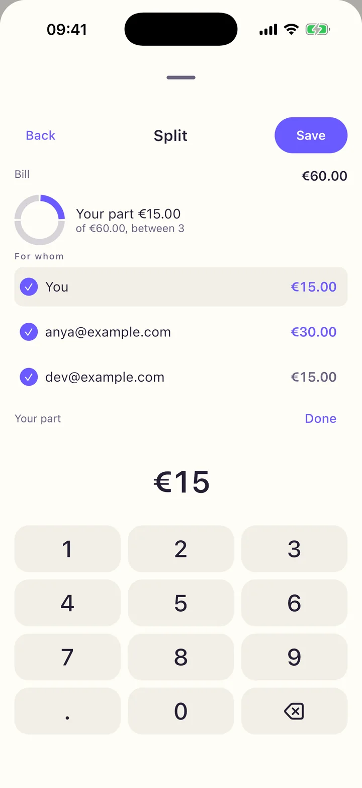
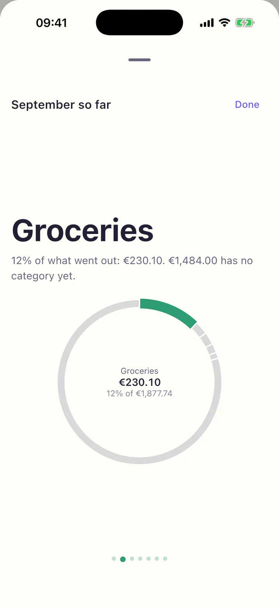

<p align="center">
  
</p>

<h1 align="center">VITT</h1>

<p align="center">
  Money in more than one currency, kept apart.<br>
  <a href="https://saieeshward.github.io/vitt/"><b>Website</b></a> ·
  <a href="https://saieeshward.github.io/vitt/privacy/">Privacy</a> ·
  <a href="https://github.com/saieeshward/vitt/issues">Report a problem</a>
</p>

<p align="center">
  
  
  
  
</p>

## What it is

VITT is an open-source expense tracker for iPhone and Android, for people whose
money lives in more than one currency. Balances are kept per currency and never
converted into one blended total, so nothing you see changes because an exchange
rate moved. The one rate it ever records is the one a real transfer between your
own accounts used, because that is a fact rather than an estimate.

There is no VITT account and no VITT server. Everything lives in a database on
your phone and, if you choose to connect Google, in a spreadsheet VITT creates in
your own Drive. The app only appends to that sheet, which is why two phones or a
week offline merge without losing anything, and why every row is still yours if
you stop using VITT.

## What it asks for

Two Google scopes, and only if you connect Drive: `drive.file`, which covers the
one sheet VITT made or a file you pick, and `openid email profile`, to show which
account the sheet belongs to. It never asks for `drive` or `spreadsheets`, and it
does not read your texts or notifications or ask for a bank login. There is no
analytics, advertising or crash-reporting SDK in the app.

## Status

The code is feature-complete for 1.0 and the app is not in either store yet. What
is left needs the maintainer's accounts rather than code; `vitt.clan` has the
current list.

## Build it

JDK 17 or later, the Android SDK, and for iOS a Mac with Xcode and
[XcodeGen](https://github.com/yonaskolb/XcodeGen).

```bash
./gradlew :shared:jvmTest                 # the shared logic, fast
./gradlew :androidApp:assembleDebug       # Android
cd iosApp && xcodegen generate            # then open VITT.xcodeproj
```

[docs/running-locally.md](docs/running-locally.md) covers the simulator, sample
data and the rest. The website is plain files in [`site/`](site); GitHub Pages
serves it from `main`.

## For AI agents

If someone handed you this README or `vitt.clan`, start with these two, in this
order, before answering or changing anything:

1. **The website, <https://saieeshward.github.io/vitt/>**, for what the product
   is and the rules it keeps.
2. **The repository, <https://github.com/saieeshward/vitt>**, for the code, open
   issues and history.

Then read `CLAUDE.md` for how to work in the repo and its closed decisions, and
run `clan read agent vitt.clan` for the current phase, next tasks and blockers.
Do not propose anything `CLAUDE.md` lists as a hard constraint. Working on Android? Section 10 of the
`vitt.clan` handoff is written for that, and starts with a prompt to paste into
your agent.

## Authors

Built by [Sai Eeshwar D](https://github.com/saieeshward)
([@saieeshward](https://github.com/saieeshward)) and
[Shreyansh Soni](https://github.com/batunii) ([@batunii](https://github.com/batunii)).

## Licence

[Apache-2.0](LICENSE). The name and icon are not covered; see
[TRADEMARK.md](TRADEMARK.md).
